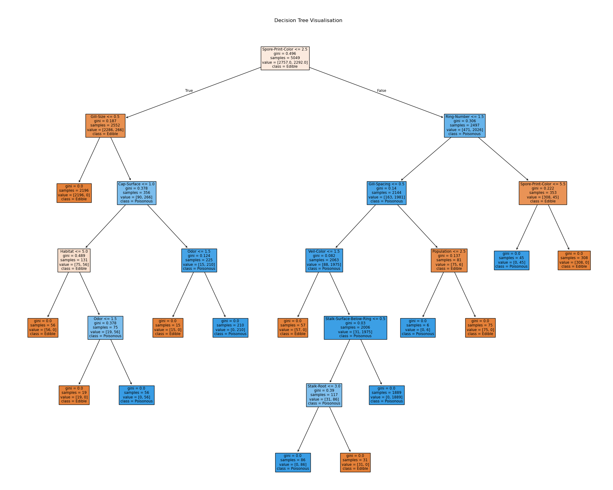
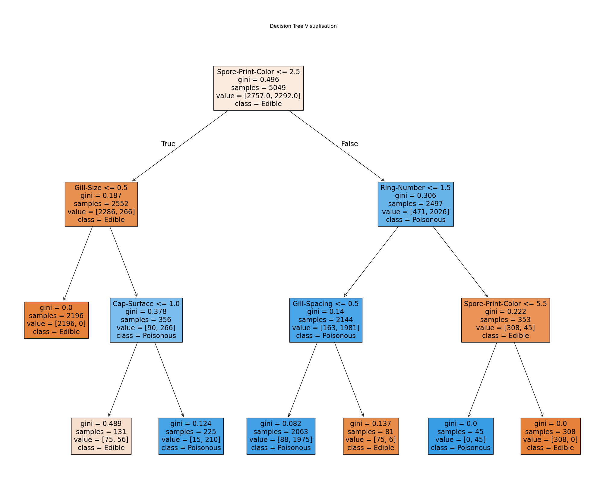

# Mushroom Classification using Decision Trees and Random Forests

The notebook was created using the notebooks available in the [Python Data Science Handbook Github Repository](https://github.com/jakevdp/PythonDataScienceHandbook).

This repository contains a [Jupyter](https://jupyter.org/) Notebook for the training of Decision Trees and Random Forests on data of features of mushrooms in the Agaricus and Lepiota Family.  
The models trained are then able to predict whether the mushroom is edible or poisonous.

# Disclaimer

**This model does not guarantee safe classification of mushrooms.  
Do not use this for ingesting mushrooms.  
Consult real world professionals on foraging and consuming mushrooms.**

### Libraries

The following libraries were used to process the data:

- [Pandas](https://pandas.pydata.org/) — Loading data, saving models
- [Scikit Learn](https://scikit-learn.org/stable/) — Training model
- [Matplotlib Pyplot](https://matplotlib.org/stable/) — Visualising results

### Data

The mushroom data was downloaded from [UC Irvine Machine Learning Repository](https://archive.ics.uci.edu/dataset/73/mushroom).
The data found on the website has 2 versions; a smaller data set with 8124 rows, and a bigger with 8416 rows. In the smaller data set only letters are used in the rows, however in the bigger one the full names are used. In this notebook the bigger version is used.

The data downloaded contains the following columns, which correspond to the features of the mushroom that have been collected for the data set:

1. **poisonous** - Whether the mushroom is EDIBLE or POISONOUS.
2. **cap-shape**
3. **cap-surface**
4. **cap-color**
5. **bruises**
6. **odor**
7. **gill-attachment**
8. **gill-spacing**
9. **gill-size**
10. **gill-color**
11. **stalk-shape**
12. **stalk-root** - A seperate category is used for missing data.
13. **stalk-surface-above-ring**
14. **stalk-surface-below-ring**
15. **stalk-color-above-ring**
16. **stalk-color-below-ring**
17. **veil-type**
18. **veil-color**
19. **ring-number**
20. **ring-type**
21. **spore-print-color**
22. **population**
23. **habitat**

### Process

The following procedure is used in the Jupyter Notebook ([Ipynb](Notebooks/MushroomClassification.ipynb), [PDF](Notebooks/MushroomClassification.pdf)) to process and visualise the data:

1.  The expanded mushroom data is imported.
2.  The data is converted from strings to integers for the models to use later. The conversion happens according to the dictionary declared before.
3.  Column of **veil-type** is ommited as only one type of category is used throughout the data set.
4.  The full data set is split into 60% training, 20% validation and 20% testing data sets.
5.  A **Decision Tree** is created however the model is overfit as it achieves an error rate of 0%, and the tree is big.

                   precision    recall  f1-score   support

               0       1.00      1.00      1.00       864
               1       1.00      1.00      1.00       819

         accuracy                          1.00      1683
         macro avg     1.00      1.00      1.00      1683
         weighted avg  1.00      1.00      1.00      1683

    _Confusion Matrix for Decision Tree:_  
    

    _Visualisation for Decision Tree:_  
    

6.  A new **Decision Tree** is trained with the **max_depth** set on it, to restrict it.

                   precision    recall  f1-score   support

               0       0.96      0.97      0.97       857
               1       0.97      0.96      0.97       826

         accuracy                          0.97      1683
         macro avg     0.97      0.97      0.97      1683
         weighted avg  0.97      0.97      0.97      1683

    _Confusion Matrix for Smaller Decision Tree:_  
    

    _Visualisation for Smaller Decision Tree:_  
    

7.  Next a **Random Forest** is created to decrease the error rate of just using a single **decision Tree**.

                   precision    recall  f1-score   support

               0       0.99      0.97      0.98       881
               1       0.97      0.99      0.98       802

         accuracy                          0.98      1683
         macro avg     0.98      0.98      0.98      1683
         weighted avg  0.98      0.98      0.98      1683

    _Confusion Matrix for Random Forest:_  
    

8.  In the end the testing set is used to measure the models.  
    **Smaller Decision Tree:**

                   precision    recall  f1-score   support

               0       0.96      0.97      0.97       859
               1       0.97      0.96      0.96       825

         accuracy                          0.97      1684
         macro avg     0.97      0.97      0.97      1684
         weighted avg  0.97      0.97      0.97      1684

    _Confusion Matrix for Smaller Decision Tree:_  
    

    **Random Forest:**

                   precision    recall  f1-score   support

               0       0.99      0.97      0.98       881
               1       0.97      0.99      0.98       803

         accuracy                          0.98      1684
         macro avg     0.98      0.98      0.98      1684
         weighted avg  0.98      0.98      0.98      1684

    _Confusion Matrix for Random Forest:_  
    

9.  Finally the **Random Forest** model is saved to disk.
